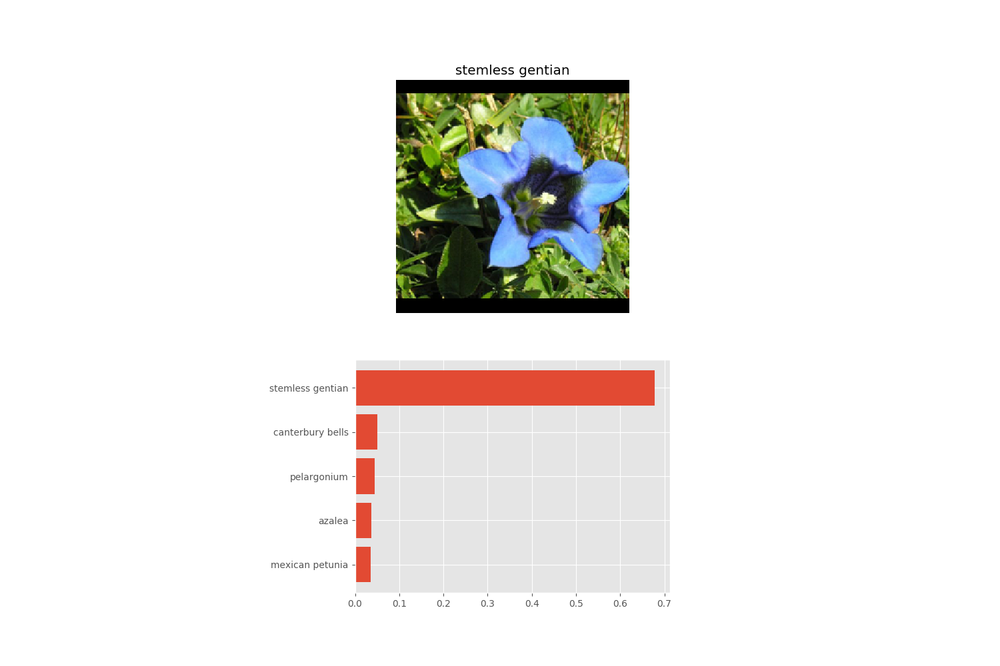

# What is it ?
This project is only for educational purposes. I did it while I was following the Udacity `DataScience nanodegree`.
It is a supervised learning classification problem in which you have to develop code for an image classifier built with 
PyTorch. It is firstly done with a notebook and then we convert it into a command line application.
The goal is to build a new classifier by using already existing models and replacing the last classifier layer by a new
one we train for a specific task (transfer learning).  
Goal of this project is to classify flowers images among 102 possible classes.  
Please refer to the notebook for more details and step by step discovery.

### Install

This project requires **Python 3.6** and the following Python libraries installed:

- [NumPy](http://www.numpy.org/) (I used 1.16.4)
- [Pandas](http://pandas.pydata.org) (I used 0.24.2)
- [matplotlib](http://matplotlib.org/) (I used 3.1.0)
- [pytorch](https://pytorch.org/) (I used 1.1.0)
- [pillow](https://pillow.readthedocs.io/en/stable/) (PIL fork, I used 6.0.0)
- [iPython Notebook](http://ipython.org/notebook.html) to run the notebook


# Command-line application
There are 2 scripts: train and predict, obviously the first one to train a model and the second one to load a previously trained model and classify an image.
## train.py parameters
Train a new network on a data set with *train.py*  
Basic usage: `python train.py data_directory`  
Prints out training loss, validation loss, and validation accuracy as the network trains

Options:
* Set directory to save checkpoints: `python train.py data_dir --save_dir save_directory`
* Choose architecture: `python train.py data_dir --arch "vgg13"`
* Set hyperparameters: `python train.py data_dir --learning_rate 0.01 --hidden_units 512 --epochs 20`
* Use GPU for training: `python train.py data_dir --gpu`

Sample:
```
python train.py  ./flowers --arch vgg16 --gpu --save_dir ./ouput
```

## predict.py parameters
Predict flower name from an image with *predict.py* along with the probability of that name.  
That is, you'll pass in a single image `/path/to/image` and return the flower name and class probability.

Basic usage: `python predict.py /path/to/image checkpoint`

Options:
* Return top KK most likely classes: `python predict.py input checkpoint --top_k 3`
* Use a mapping of categories to real names: `python predict.py input checkpoint --category_names cat_to_name.json`
* Use GPU for inference: `python predict.py input checkpoint --gpu`

Sample:
```
python predict.py ./flowers/valid/28/image_05265.jpg output/checkpoint-script.pth --top_k 5 --category_names cat_to_name.json --gpu
```

It then generates a picture like this one:
